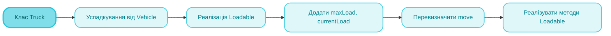
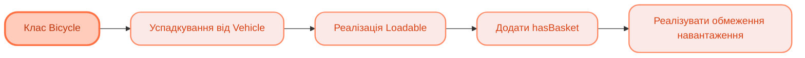

<sup>📒 Readme ver 1.0 08.11.2025 02:40<sup/>

<picture>
  <source media="(prefers-color-scheme: dark)" src="https://github.com/user-attachments/assets/3099ab98-c824-471a-ae04-1c04cef81c26" />
  <source media="(prefers-color-scheme: light)" src="https://github.com/user-attachments/assets/0aecfea6-0be1-4282-a753-f3324645d5af">
  
</picture>

# `Лабораторна робота` `№4` `Принципи та особливості ООП`

[](https://docs.google.com/document/d/19unIe4WaBjPMkZOxbllCGPG0m37LRf8r/edit?usp=drive_link&ouid=110536394177911584125&rtpof=true&sd=true)
[](https://github.com/Soluvent)


[](https://github.com/Soluvent/TransportCompany-Fourth/edit/main/README.md)

## `📝 Завдання `
### Транспортна компанія
  - [x] Створити абстрактний клас Vehicle із методом move()
  - [x] Створити підкласи Bus, Truck, Bicycle
  - [x] Додати інтерфейс Loadable для завантаження вантажу
  - [x] Реалізувати сценарій, де різні транспортні засоби рухаються і перевозять вантажі
  - [x] Застосувати принципи інкапсуляції, успадкування та поліморфізму

## `🧠 Mindmap `





## `🛠️ Реалізація коду `

### **Абстрактний клас Vehicle**
> [!NOTE]
> Базовий абстрактний клас, який визначає загальні властивості всіх транспортних засобів. Містить захищені поля `brand` та `capacity`, а також абстрактний метод `move()`, який кожен підклас повинен реалізувати по-своєму.

<h4 align="wide">

```java
abstract class Vehicle {
    protected String brand;
    protected int capacity;

    public Vehicle(String brand, int capacity) {
        this.brand = brand;
        this.capacity = capacity;
    }

    // Абстрактний метод для руху
    public abstract void move();

    // Гетери
    public String getBrand() {
        return brand;
    }

    public int getCapacity() {
        return capacity;
    }

    public void displayInfo() {
        System.out.println("Транспортний засіб: " + brand + ", місткість: " + capacity);
    }
}
```

### **Інтерфейс Loadable**
> [!NOTE]
> Інтерфейс визначає контракт для транспортних засобів, які можуть завантажувати вантаж. Включає методи для завантаження, розвантаження та отримання інформації про поточне та максимальне навантаження.

<h4 align="wide">

```java
interface Loadable {
    void loadCargo(double weight);
    void unloadCargo();
    double getCurrentLoad();
    double getMaxLoad();
}
```

### **Клас Bus**
> [!NOTE]
> Клас автобусу, успадкований від Vehicle. Реалізує функціонал для посадки та висадки пасажирів з перевіркою місткості. Перевизначає метод `move()` для специфічної поведінки автобусу.

<h4 align="wide">

```java
class Bus extends Vehicle {
    private int passengerCount;

    public Bus(String brand, int capacity) {
        super(brand, capacity);
        this.passengerCount = 0;
    }

    @Override
    public void move() {
        System.out.println("Автобус " + brand + " їде по міському маршруту");
    }

    public void boardPassengers(int count) {
        if (passengerCount + count <= capacity) {
            passengerCount += count;
            System.out.println(count + " пасажирів сіли в автобус. Всього: " + passengerCount);
        } else {
            System.out.println("Недостатньо місць! Максимум: " + capacity);
        }
    }

    public void dropPassengers(int count) {
        if (count <= passengerCount) {
            passengerCount -= count;
            System.out.println(count + " пасажирів вийшли з автобусу. Залишилось: " + passengerCount);
        }
    }
}
```

### **Клас Truck**
> [!NOTE]
> Клас вантажівки, що успадковується від Vehicle та реалізує інтерфейс Loadable. Підтримує завантаження та розвантаження вантажу з контролем максимального навантаження. Демонструє множинне успадкування через інтерфейси.

<h4 align="wide">

```java
class Truck extends Vehicle implements Loadable {
    private double maxLoad;
    private double currentLoad;

    public Truck(String brand, int capacity, double maxLoad) {
        super(brand, capacity);
        this.maxLoad = maxLoad;
        this.currentLoad = 0;
    }

    @Override
    public void move() {
        System.out.println("Вантажівка " + brand + " їде по шосе з вантажем " + currentLoad + " кг");
    }

    @Override
    public void loadCargo(double weight) {
        if (currentLoad + weight <= maxLoad) {
            currentLoad += weight;
            System.out.println("Завантажено " + weight + " кг. Поточний вантаж: " + currentLoad + " кг");
        } else {
            System.out.println("Перевантаження! Максимум: " + maxLoad + " кг");
        }
    }

    @Override
    public void unloadCargo() {
        System.out.println("Розвантажено " + currentLoad + " кг");
        currentLoad = 0;
    }

    @Override
    public double getCurrentLoad() {
        return currentLoad;
    }

    @Override
    public double getMaxLoad() {
        return maxLoad;
    }
}
```

### **Клас Bicycle**
> [!NOTE]
> Клас велосипеда з опціональним кошиком для вантажу. Реалізує Loadable з обмеженим максимальним навантаженням, яке залежить від наявності кошика. Демонструє гнучкість ООП через умовну логіку.

<h4 align="wide">

```java
class Bicycle extends Vehicle implements Loadable {
    private double maxLoad;
    private double currentLoad;
    private boolean hasBasket;

    public Bicycle(String brand, boolean hasBasket) {
        super(brand, 1);
        this.hasBasket = hasBasket;
        this.maxLoad = hasBasket ? 10.0 : 5.0;
        this.currentLoad = 0;
    }

    @Override
    public void move() {
        System.out.println("Велосипед " + brand + " їде по велодоріжці");
    }

    @Override
    public void loadCargo(double weight) {
        if (!hasBasket && weight > 0) {
            System.out.println("Велосипед не має кошика для вантажу!");
            return;
        }
        if (currentLoad + weight <= maxLoad) {
            currentLoad += weight;
            System.out.println("Завантажено " + weight + " кг у кошик. Поточний вантаж: " + currentLoad + " кг");
        } else {
            System.out.println("Кошик переповнений! Максимум: " + maxLoad + " кг");
        }
    }

    @Override
    public void unloadCargo() {
        if (currentLoad > 0) {
            System.out.println("Розвантажено " + currentLoad + " кг з кошика");
            currentLoad = 0;
        }
    }

    @Override
    public double getCurrentLoad() {
        return currentLoad;
    }

    @Override
    public double getMaxLoad() {
        return maxLoad;
    }
}
```

### **Демонстрація роботи системи**
> [!NOTE]
> Головний клас демонструє всі принципи ООП: поліморфізм через базовий клас Vehicle та інтерфейс Loadable, інкапсуляцію через приватні поля та публічні методи, успадкування через ієрархію класів.

<h4 align="wide">

```java
class TransportCompanyDemo {
    public static void main(String[] args) {
        System.out.println("=== ТРАНСПОРТНА КОМПАНІЯ ===\n");

        // Створення транспортних засобів
        Bus bus = new Bus("Mercedes", 50);
        Truck truck = new Truck("Volvo", 2, 15000);
        Bicycle bicycle = new Bicycle("Giant", true);

        // Демонстрація поліморфізму через базовий клас
        System.out.println("--- Поліморфізм: всі транспортні засоби рухаються ---");
        Vehicle[] vehicles = {bus, truck, bicycle};
        for (Vehicle v : vehicles) {
            v.displayInfo();
            v.move();
            System.out.println();
        }

        // Робота з автобусом
        System.out.println("--- Робота з автобусом ---");
        bus.boardPassengers(30);
        bus.move();
        bus.boardPassengers(25);
        bus.dropPassengers(15);
        System.out.println();

        // Робота з вантажівкою
        System.out.println("--- Робота з вантажівкою ---");
        truck.loadCargo(5000);
        truck.loadCargo(8000);
        truck.move();
        truck.loadCargo(3000); // Спроба перевантаження
        truck.unloadCargo();
        System.out.println();

        // Робота з велосипедом
        System.out.println("--- Робота з велосипедом ---");
        bicycle.loadCargo(7);
        bicycle.move();
        bicycle.loadCargo(5); // Спроба перевантаження
        bicycle.unloadCargo();
        System.out.println();

        // Поліморфізм через інтерфейс Loadable
        System.out.println("--- Поліморфізм: завантаження вантажу ---");
        Loadable[] loadableVehicles = {truck, bicycle};
        for (Loadable lv : loadableVehicles) {
            System.out.println("Максимальне навантаження: " + lv.getMaxLoad() + " кг");
            lv.loadCargo(5);
            System.out.println("Поточне навантаження: " + lv.getCurrentLoad() + " кг");
            System.out.println();
        }

        // Демонстрація інкапсуляції
        System.out.println("--- Демонстрація інкапсуляції ---");
        System.out.println("Бренд автобусу: " + bus.getBrand());
        System.out.println("Місткість: " + bus.getCapacity());
    }
}
```

## `✨ Особливості реалізації `

### Інкапсуляція
- Всі поля класів оголошені як `private` або `protected`
- Доступ до даних здійснюється через публічні методи (гетери/сетери)
- Внутрішній стан об'єктів захищений від прямої зміни

### Успадкування
- Базовий абстрактний клас `Vehicle` визначає загальну функціональність
- Підкласи `Bus`, `Truck`, `Bicycle` успадковують та розширюють базову функціональність
- Використання `super()` для виклику конструктора базового класу

### Поліморфізм
- Перевизначення методу `move()` у кожному підкласі
- Робота з об'єктами через посилання на базовий клас
- Реалізація інтерфейсу `Loadable` різними класами

### Абстракція
- Абстрактний клас `Vehicle` визначає контракт для всіх транспортних засобів
- Інтерфейс `Loadable` визначає контракт для завантаження вантажу
- Розділення абстракції та реалізації
